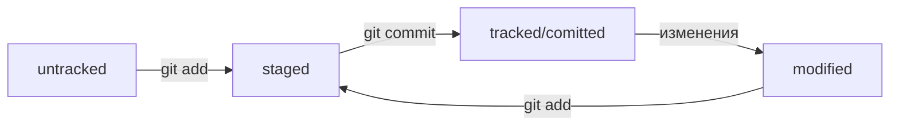

# Шпаргалка по Git

## Навигация

* **pwd** (от англ. print working directory, «показать рабочую папку») — покажи, в какой я папке;
* **ls** (от англ. list directory contents, «отобразить содержимое директории») — покажи файлы и папки в текущей папке;
* **ls -a** — покажи также скрытые файлы и папки, названия которых начинаются с символа .;
* **cd first-project** (от англ. change directory, «сменить директорию») — перейди в папку first-project;
* **cd first-project/html** — перейди в папку html, которая находится в папке first-project;
* **cd ..** — перейди на уровень выше, в родительскую папку;
* **cd ~**  — перейди в домашнюю директорию (/Users/Username);
* **cd /** — перейди в корневую директорию.

## Работа с файлами и папками

### Создание

* **touch index.html** (англ. touch, «коснуться») — создай файл index.html в текущей папке;
* **touch index.html style.css script.js** — если нужно создать сразу несколько файлов, можно напечатать их имена в одну строку через пробел;
* **mkdir second-project** (от англ. make directory, «создать директорию») — создай папку с именем second-project в текущей папке.

### Копирование и перемещение

* **cp file.txt ~/my-dir** (от англ. copy, «копировать») — скопируй файл в другое место;
* **mv file.txt ~/my-dir** (от англ. move, «переместить») — перемести файл или папку в другое место.

### Чтение

* **cat file.txt** (от англ. concatenate and print, «объединить и распечатать») — распечатай содержимое текстового файла file.txt.

### Удаление

* **rm about.html** (от англ. remove, «удалить») — удали файл about.html;
* **rmdir images** (от англ. remove directory, «удалить директорию») — удали папку images;
* **rm -r second-project** (от англ. remove, «удалить» + recursive, «рекурсивный») — удали папку second-project и всё, что она содержит.

## Настройка Git

Работа с файлом настройки .gitconfig

``` bash
git config --global user.name "John Doe"
git config --global user.email johndoe@example.com
```

Посмотреть содержимое
``` bash
git config --list
```

Сделать папку репозиторием — 
``` bash
git init
```

«Разгитить» папку, если что-то пошло не так, — rm -rf .git

``` bash
$ cd <папка с репозиторием> # перешли в папку  
$ rm -rf .git # удалили подпапку .git
```

Проверить состояние репозитория — 
``` bash
git status
```

Подготовить файлы к сохранению — 
``` bash
git add
```

Флаг **--all** позволяет подготовить к сохранению все файлы в репозитории.

Выполнить коммит — 
``` git bash
commit -m "Какой-то коммент"
```

Просмотреть историю коммитов — 
``` bash
git log
```

## GitHub

### SSH

Проверить наличие SSH-ключа

``` bash
$ cd ~
$ ls -la .ssh/ #вывели список созданных ключей
```

Если есть файлы с похожими названиями, SSH-ключи уже создавались:
* id_dsa.pub;
* id_ecdsa.pub;
* id_ed25519.pub;
* id_rsa.pub.
Если вы не создавали эти файлы, удалите их все.

Генерация SSH-ключа
``` bash
ssh-keygen -t ed25519 -C "электронная почта, к которой привязан ваш аккаунт на GitHub"
```

Если вы видите сообщение об ошибке, то, скорее всего, ваша система не поддерживает алгоритм шифрования ed25519. 
Ничего страшного: используйте другой алгоритм. Например, rsa.

* id_ed25519/id_rsa — приватный ключ (файл без .pub в конце). Ни в коем случае не копируйте его и не делитесь им.
* id_ed25519.pub/id_rsa.pub — публичный ключ (на это указывает расширение .pub).
* Скопируйте содержимое файла с публичным ключом в буфер обмена. 
``` bash
clip <~/.ssh/id_ed25519.pub
```

1.	Перейдите на GitHub и выберите пункт Settings (англ. «настройки») в меню аккаунта.
2.	В меню слева нажмите на пункт SSH and GPG keys.
3.	В открывшейся вкладке выберите New SSH key (англ. «новый SSH-ключ»).
4.	В поле Title (англ. «заголовок») напишите название ключа. Например, Personal key (англ. «личный ключ»).
5.	В поле Key type (англ. «тип ключа») должно быть Authentication Key (англ. «ключ аутентификации»).
6.	В поле Key скопируйте ваш ключ из буфера обмена.
7. Нажмите на кнопку Add SSH key (англ. «добавить SSH-ключ»).

```bash
$ ssh -T git@github.com #проверить правильность ключа 
```

### Привязать удалённый репозиторий к локальному — git remote add

Перейдите на страницу удалённого репозитория, выберите тип SSH и скопируйте URL

``` bash
git remote add origin ссылка с гитхаб #находясь в папке с локальным репозиториеем
```

Убедиться, что репозитории связаны, 
``` bash
— git remote -v
```

Отправить изменения на удалённый репозиторий — 
``` bash
git push
```

В первый раз нужно добавить флаг -u и параметры origin и master/main.
В дальшейшем просто 
``` bash
git push
```

### Файл README.md

1.	Название проекта и его краткое описание: кем создан, для чего, какие решает задачи и какие закрывает проблемы.
2.	Технологии, которые применяются в проекте. В чём его отличие от аналогичных.
3.	Документация проекта — подробная инструкция о том, что представляет собой проект.
4.	Планы проекта, если они есть.

### Хеш — идентификатор коммита

**Хеширование** (от англ. hash, «рубить», «крошить», «мешанина») — это способ преобразовать набор данных и получить их «отпечаток» (англ. fingerprint).
Информация о коммите — это набор данных: когда был сделан коммит, содержимое файлов в репозитории на момент коммита и ссылка на предыдущий, или родительский (англ. parent), коммит.

Хеш — основной идентификатор коммита
Git хранит таблицу соответствий хеш → информация о коммите. Если вы знаете хеш, вы можете узнать всё остальное: автора и дату коммита и содержимое закоммиченных файлов. Можно сказать, что хеш — основной идентификатор коммита.

Получить сокращённый лог — 
``` bash
git log --oneline
```

💡 Обратите внимание: если выход из просмотра логов не произошёл автоматически, нажмите клавишу Q (от англ. Quit — «выйти») в английской раскладке клавиатуры.

### Файл HEAD

Файл HEAD (англ. «голова», «головной») — один из служебных файлов папки .git. Он указывает на коммит, который сделан последним (то есть на самый новый).

``` bash
$ pwd # посмотрели, где мы

$ cd .git/
$ ls # посмотрели, какие есть файлы
COMMIT_EDITMSG  ORIG_HEAD  description  index  logs/     refs/
HEAD            config     hooks/       info/  objects/

$ cat HEAD # команда cat показывает содержимое файла
ref: refs/heads/master # в файле вот такая ссылка
```

### Статусы файлов в Git

*	**untracked** (англ. «неотслеживаемый») Мы говорили, что новые файлы в Git-репозитории помечаются как untracked, то есть неотслеживаемые. Git «видит», что такой файл существует, но не следит за изменениями в нём. У untracked-файла нет предыдущих версий, зафиксированных в коммитах или через команду git add. 
*	**staged** (англ. «подготовленный»). После выполнения команды git add файл попадает в staging area (от англ. stage — «сцена», «этап [процесса]» и area — «область»), то есть в список файлов, которые войдут в коммит. В этот момент файл находится в состоянии staged.
*	**tracked** (англ. «отслеживаемый») Состояние tracked — это противоположность untracked. Оно довольно широкое по смыслу: в него попадают файлы, которые уже были зафиксированы с помощью git commit, а также файлы, которые были добавлены в staging area командой git add. То есть все файлы, в которых Git так или иначе отслеживает изменения. 
*	**modified** (англ. «изменённый») Состояние modified означает, что Git сравнил содержимое файла с последней сохранённой версией и нашёл отличия. Например, файл был закоммичен и после этого изменён


Для диаграммы использован [Mermaid](https://github.blog/2022-02-14-include-diagrams-markdown-files-mermaid/)

### Типичный жизненный цикл файла в Git

1.	Файл только что создали. Git ещё не отслеживает содержимое этого файла. Состояние: untracked.
2.	Файл добавили в staging area с помощью git add. Состояние: staged (+ tracked). 
*	Возможно, изменили файл ещё раз. Состояния: staged, modified (+ tracked). Обратите внимание: staged и modified у одного файла, но у разных его версий.
*	Ещё раз выполнили git add. Состояние: staged (+ tracked).
4.	Сделали коммит с помощью git commit. Состояние: tracked.
5.	Изменили файл. Состояние: modified (+ tracked).
6.	Снова добавили в staging area с помощью git add. Состояния: staged (+ tracked).
7.	Сделали коммит. Состояния: tracked.
8.	Повторили пункты 4−74−7 много-много раз.

### Просмотр состояния файлов

``` bash
git status
```
 (от англ. status, «статус», «состояние») — покажи текущее состояние репозитория.

### Добавление изменений в последний коммит

``` bash
git commit --amend --no-edit
```
(от англ. amend, «исправить») — добавь изменения к последнему коммиту и оставь сообщение прежним;
``` bash
git commit --amend -m "Новое сообщение"
```
— измени сообщение к последнему коммиту на Новое сообщение.

💡 Выйти из редактора Vim: нажать Esc, ввести :qa!, нажать Enter.

### «Откат» файлов и коммитов

``` bash
git restore --staged hello.txt
```
(от англ. restore, «восстановить») — переведи файл hello.txt из состояния staged обратно в untracked или modified;

``` bash
git restore hello.txt
```
верни файл hello.txt к последней версии, которая была сохранена через git commit или git add;

``` bash
git reset --hard b576d89
```
(от англ. reset, «сброс», «обнуление» + hard, «суровый») — удали все незакоммиченные изменения из staging и «рабочей зоны» вплоть до указанного коммита.

### Просмотр изменений

``` bash
git diff
```
(от англ. difference, «отличие», «разница») — покажи изменения в «рабочей зоне», то есть в modified-файлах;

``` bash
git diff a9928ab 11bada1
```
выведи разницу между двумя коммитами;

``` bash
git diff --staged
```
покажи изменения, которые добавлены в staged-файлах.

## Работа с ветками

### Клонирование чужого репозитория

``` bash
git clone git@github.com:YandexPraktikum/first-project.git
```
(от англ. clone, «клон», «копия») — склонируй репозиторий с URL first-project.git из аккаунта YandexPraktikum на мой локальный компьютер.

### Создание веток

``` bash
git branch feature/the-finest-branch
```
(от англ. branch, «ветка») — создай ветку от текущей с названием feature/the-finest-branch;

``` bash
git checkout -b feature/the-finest-branch
```
создай ветку feature/the-finest-branch и сразу переключись на неё.
### Навигация по веткам
``` bash
git branch
```
(от англ. branch, «ветка») — покажи, какие есть ветки в репозитории и в какой из них я нахожусь (текущая ветка будет отмечена символом *);

``` bash
git branch -a
```
покажи все известные ветки, как локальные (в локальном репозитории), так и удалённые (в origin, или на GitHub).

``` bash
git checkout feature/br
```
переключись на ветку feature/br.

### Сравнение веток

``` bash
git diff main HEAD
```
(от англ. difference, «отличие», «разница») — покажи разницу между веткой main и указателем на HEAD;

``` bash
git diff HEAD~2 HEAD
```
покажи разницу между тем коммитом, который был два коммита назад, и текущим.

### Удаление веток

``` bash
git branch -d br-name
```
удали ветку br-name, но только если она является частью main;

``` bash
git branch -D br-name
```
удали ветку br-name, даже если она не объединена с main.

### Слияние веток

``` bash
git merge main
```
(от англ. merge, «сливать», «поглощать») — объедини ветку main с текущей активной веткой. 

### Работа с удалённым репозиторием

``` bash
git push -u origin my-branch
```
(от англ. push, «толкнуть», «протолкнуть») — отправь новую ветку my-branch в удалённый репозиторий и свяжи локальную ветку с удалённой, чтобы при дополнительных коммитах можно было писать просто git push без -u;

``` bash
git push my-branch```
отправь дополнительные изменения в ветку my-branch, которая уже существует в удалённом репозитории;

``` bash
git pull
```
(от англ. pull, «вытянуть») — подтяни изменения текущей ветки из удалённого репозитория.

## Командная работа в Git

### Feature branch workflow

Самый популярный подход к работе с Git в команде — это **feature branch workflow**. В нём создают ветку для каждой задачи (например, для новой функциональности или исправления бага), а когда всё готово, вливают новую ветку в main.

Важные этапы этого процесса — пул-реквест и ревью изменений. Пул-реквест — это интерфейс, в котором можно обсудить изменения. Ревью — просмотр изменений другими участниками и один из способов проверить качество таких изменений.

Если вы уже участник проекта (или collaborator в терминах GitHub), можно клонировать репозиторий напрямую. А если нет, нужно предварительно сделать «форк». Также для участников доступна кнопка Merge после ревью, а для неучастников — нет.

### Конфликты слияния

Когда один и тот же файл меняется в нескольких ветках, при их слиянии может произойти конфликт. Пугаться конфликтов не нужно, это нормальная часть работы с системами контроля версий. IDE, вроде VSCode или Intellij IDEA, помогут «склеить» файл из двух конфликтующих версий.

**Алгоритм-шпаргалка для создания PR**

1.	Склонировать репозиторий.

2.	Если вы не участник проекта, предварительно сделать «форк» исходного репозитория.

3.	На странице репозитория или «форка» нажать кнопки: Code → SSH → скопировать ссылку.

4.	Выполнить команду git clone <ссылка на репозиторий>.

5.	Создать ветку для вашей задачи: git checkout -b my-task-branch-name.

6.	Добавить и «закоммитить» изменения, которые вы хотите внести в проект.

7.	«Запушить» ветку: ```git push --set-upstream origin HEAD``` или ```git push -u origin my-task-branch-name```.

8.	GitHub (с помощью Git) выведет ссылку на создание PR. По ней нужно перейти.

9.	PR можно также создать через интерфейс GitHub.

10.	Сообщить о пул-реквесте ревьюеру.

11.	Иногда ревьюеры назначаются автоматически, тогда сообщать не нужно.

12.	Обсуждать с ревьюером предлагаемые изменения и вносить правки, пока эти изменения не будут одобрены (пока не будет получен «апрув»).
  
13.	Если кто-то добавил конфликтующие изменения в main, пока ваш PR был на ревью, нужно разрешить конфликт:  

	*	Обновить main: ```git checkout main && git pull```
	
	*	Влить main в свою ветку: ```git checkout my-task-branch-name && git merge main```
	
	*	Разрешить конфликты слияния с помощью IDE или вручную.
	
	*	Создать коммит слияния: ```git commit --no-edit``` или ```git commit -m 'merge main'```
	
	*	Сделать git push своей ветки.
	
14.	Нажать кнопку Merge или подождать, пока её нажмёт кто-то ещё.

15.	Ещё раз обновить main, чтобы «подтянуть» ваши изменения в основную ветку локального репозитория: ```git checkout main && git pull```

16.	Вы великолепны! Можете начинать снова со второго пункта.

### Алгоритм-шпаргалка для разрешения конфликтов слияния

1.	Открыть проект в IDE (VS Code, IDEA или другие).

2.	Открыть файл, в котором есть конфликт.

3.	Выбрать, какие части файла нужно взять из одной ветки, а какие — из другой.

4.	Когда конфликты разрешены, сделать коммит: ```git commit --no-edit``` или ```git commit -m 'merge branch <название ветки>'```


---
P.s. Спасибо Яндекс Практикум за [курс по Гит](https://practicum.yandex.ru/git-basics/). 
